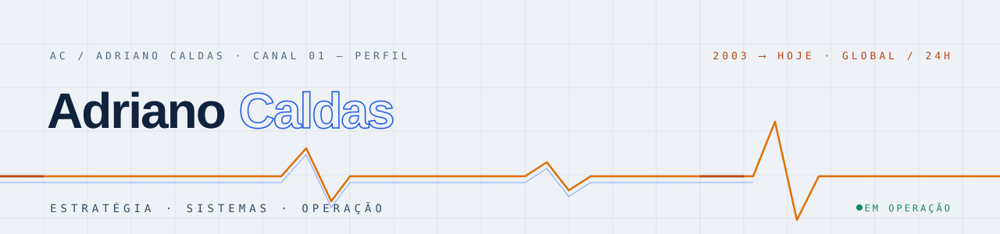

<picture>
  <source media="(prefers-color-scheme: dark)" srcset="assets/banner-dark.svg">
  
</picture>

[PT](./README.md) · **EN** · [ES](./README.es.md) · [NO](./README.no.md)

# Adriano César Moreno Caldas

> Technology seen end to end: from decision to production, from algorithm to global operations.

I work across technology direction, product creation and complex operations. I have served in CTO roles in multinational organisations and lead owned and third-party initiatives across different countries. Since 2003 I have worked with digital signal processing, artificial intelligence algorithms and model training — a foundation that has grown into broad work across software, telecommunications, cloud, networks, automation and applied electronics.

## Capabilities

| | | |
|---|---|---|
| `DIR` | **Technology strategy and direction** | CTO · IT · product · programmes · suppliers · ITSM |
| `SFT` | **Software and digital products** | frontend · backend · APIs · QA · Windows · Linux · macOS · Android · iOS |
| `AIM` | **AI, signals and models** | DSP · ML · deep learning · LLMs · agents · RAG · MLOps · GPU |
| `CLD` | **Cloud, networks and operations** | AWS · Azure · Google Cloud · Kubernetes · IaC · DevOps · SRE |
| `DAT` | **Data, integrations and platforms** | SQL · NoSQL · ETL/ELT · streaming · data governance · analytics |
| `SEC` | **Security and resilience** | IAM · Zero Trust · vulnerabilities · DR · continuity · compliance |
| `AUT` | **Automation and physical systems** | firmware · PCB · IoT · edge · OT · SCADA/HMI · control |
| `DIG` | **Digital presence and growth** | media · paid acquisition · technical SEO · GEO · LLMO · reputation |

## Ecosystem

**Owned products** — [Cinteca](https://cinteca.es) · [LegalNeuron](https://legalneuron.es) · [NordixBIOS](https://nordixbios.com) · [NCS Engine](https://ncsengine.com) · [Nordix Systems](https://nordixsystems.com) · [CINTE](https://cinte.com.br)

**Selected collaborations** — [Plorea · Norway](https://plorea.no) · [Grupo Laeras](https://grupolaeras.com) · [Innocards Loyalty · Switzerland](https://innocardloyalty.ch)

## Journey

```text
2003 ──╥── Signals, algorithms and models
2004 ──╫── CINTE · Telecommunications
2014 ──╫── AD Caldas Innotec, S.A. (Spain · Tax ID A66316399)
TODAY ─╨── Global ecosystem: software, AI, infrastructure and connected systems
```

## Contact

**[adrianocaldas.com](https://adrianocaldas.com)** — messages via the website's [protected channel](https://adrianocaldas.com/?lang=en#contato). No cookies, no analytics, no personal email published.

---

<sub>`» continuous signal since 2003 · in operation`</sub>
